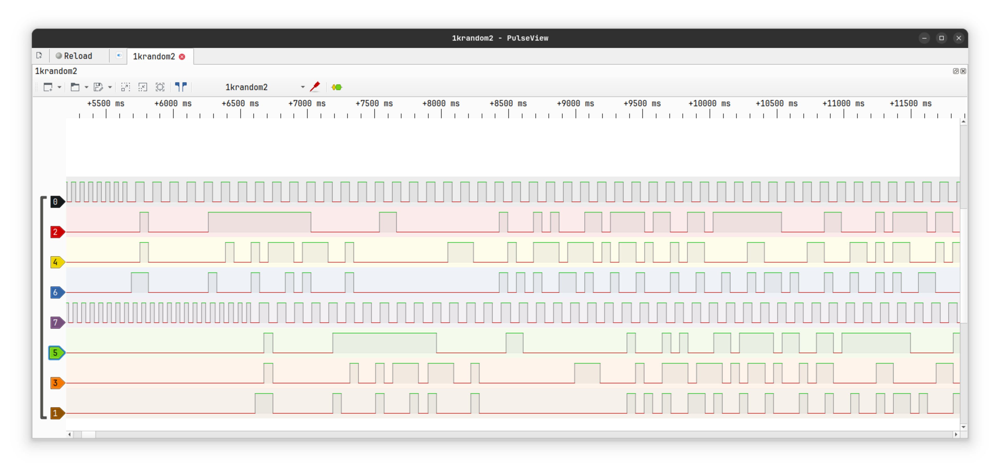
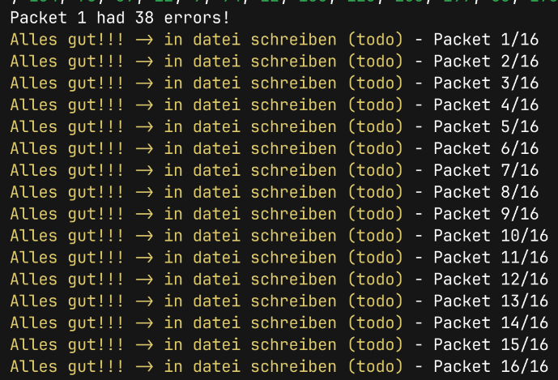

# V7 - Networking (HWP2)
## 4.1 Übertragung
### Beschreibung der Binärkodierung
Die Binärkodierung ermöglicht eine bidirektionale Übertragung mit jeweils 3 Datenleitungen und einer Taktleitung. Ein 3-Bit-Code wird immer in der Hälfte eines Taktes gelesen, wodurch in 3 Takten insgesamt 9 Bits übertragen werden. Davon repräsentieren 8 Bits ein Byte, während das letzte Bit angibt, ob es sich um ein Kontroll-Byte handelt.
```
// C = Clock
// D = Data
// I = Control Bit
CDDD
CDDD
CDDI
// Hier wird jeweilig Clock beibehalten, die Daten gesetzt, Clock umgeändert und die Daten beibehalten.
```
### Beschreibung des Protokolls
Das Protokoll ist fundamental aus Transmissionen zusammengebaut. Eine Transmission besteht aus einem SOT (Start of Transmission) Kontroll-Byte, gefolgt von einem Transmission-Header der Metadaten wie der Packet-Anzahl und ob die Transmission eine Enquiry ist. Dieser Header besitzt 4 Bytes an ECC um sicher zu stellen, das die Metadaten korrekt ankommen. Nach dem Transmission-Header kommen die Packets. Diese fangen durch ein SOH (Start of Header) Kontroll-Byte an, gefolgt von der Größe des Packets, der Packet-ID und der Größe der ECC-Bytes. Danach kommt ein SOTX (Start of Text) Kontroll-Byte, was den Start der Daten Markiert. Am Ende einer Transmission wird dann noch ein EOT (End of Transmission) Kontroll-Byte gesendet.

Beim Empfangen einer Transmission wird nach dem Empfangen von SOT und EOT die Transmission wieder in Programm-lesbare Strukturen eingelesen und dekodiert. Wenn ein Packet zu viele Fehler beinhaltet, als dass es durch Reed-Solomon Error Correction wiederhergestellt werden kann, oder gar komplett fehlt, wird die Packet-ID vermerkt. Nachdem alles eingelesen wurde, werden die Packet-IDs der fehlenden oder kaputten Packets als Daten eines Packets gespeichert und in eine Transmission mit `is_enquiry` auf true gesetzt gelagert und versandt.

Hat die empfangene Transmission die Enquiry-Flag gesetzt, werden die Daten der Packets nicht als Binär-Daten, sondern als eine Liste an Packet-IDs interpretiert. Nachdem alles eingelesen und dekodiert ist, werden die Angefragten Packets in eine neue Transmission gepackt und wieder versandt. Sollte nach dem kompletten Versenden einer Enquiry für eine gewisse Zeit nichts empfangen (Timeout) werden, geht das Protokoll davon aus, dass sie nicht angekommen ist und sendet sie erneut.
### Bild von Logicanalyzer
Das Bild zeigt den Anfang der Übertragung einer 1kB großen Datei.



## 4.2 | 4.4 Fehlererkennung und Neuübertragung
Das Übertragungsprotokoll wurde mit einer Fehlererkennung ausgestattet, die über einfache Paritätsbits hinausgeht, um eine zuverlässige Datenübertragung zu gewährleisten. Zur Fehlererkennung und -korrektur kommen spezielle Fehlerkorrektur-Codes (Error Correction Codes, ECC) zum Einsatz, die auf dem bewährten Reed-Solomon-Algorithmus basieren.
Ein Drittel der Daten in jedem Paket besteht aus redundanten Informationen, die für die Fehlerkorrektur verwendet werden. Diese Redundanz ermöglicht es, die Datenintegrität zu überprüfen, kleinere Fehler direkt zu korrigieren und im Falle schwerwiegender Fehler eine erneute Übertragung des fehlerhaften Pakets auszulösen.
Durch diesen Ansatz wird sichergestellt, dass Daten auch unter schwierigen Bedingungen oder bei schlechter Signalqualität korrekt und zuverlässig übertragen werden können.



Hierbei handelt es sich um einen Prototypen. Es konnten 38 kaputte Bytes korrigiert werden ohne das Packet neu zu übertragen.
### Reed-Solomon
#### 1. Daten als Polynom darstellen
Die zu übertragenden oder zu speichernden Daten werden in Blöcke unterteilt und als ein Polynom interpretiert. Das Polynom hat die Form:

$P(x) = a_0 + a_1x + a_2x^2 + \dots + a_{k-1}x^{k-1}$

Dabei repräsentiert jeder Koeffizient \($a_i$) ein Datenwort.
#### 2. Redundanz hinzufügen
Reed-Solomon fügt Redundanz hinzu, indem ($n - k$) zusätzliche Koeffizienten berechnet werden. Diese zusätzlichen Daten basieren auf den ursprünglichen $(k$) Daten und werden durch Evaluierung des Polynoms an mehreren Punkten ($x_i$) erzeugt. Das erweiterte Polynom hat dann ($n$) Punkte.
#### 3. Fehler erkennen und korrigieren
Während der Übertragung können Fehler auftreten. Reed-Solomon nutzt die zusätzlichen Redundanzdaten, um festzustellen, ob und wo Fehler aufgetreten sind. Dazu werden die empfangenen Daten mit dem erwarteten Polynom verglichen:
- Wenn die Anzahl der Fehler kleiner oder gleich \($\frac{n-k}{2}$) ist, können alle Fehler korrigiert werden.
- Der Decoder identifiziert die fehlerhaften Positionen und rekonstruiert die korrekten Daten durch Interpolation des ursprünglichen Polynoms.
[Quelle](https://en.wikipedia.org/wiki/Reed%E2%80%93Solomon_error_correction)
## 4.3 Übertragung größerer Dateien
Das System funktioniert erfolgreich und ermöglicht dank des implementierten Paketsystems auch die fehlerfreie Übertragung großer Datenmengen.
Die einzigen limiterenden Faktoren sind Packet-ID größe (momentan 16bit) und der Arbeitsspeicher verbrauch. Das Problem der Packet-IDs kann recht einfach gelöst werden, indem man die größe ihres Types ändert (z.B. 64bit).
Die Kommunikation zwischen zwei Arduinos weist eine Verzögerung von nur 4ms pro Nibble auf, während beim B15f 29ms pro Nibble anfallen. Ein 1 GB großer Datensatz benötigt bei der Arduino-Arduino-Verbindung etwa 19 Stunden und ist damit schneller als die B15f-Alternative.
## 4.5 Geschwindigkeitsvergleich
Vergleich der Geschwindigkeit mit `scp, netcat, rsync`

|                           | B15f-Arduino          | Arduino-Arduino      | scp            | netcat           | rsync          |
|---------------------------|-----------------------|----------------------| -------------- | ---------------- | -------------- |
| Geschwindigkeit in | 1024B/586s = 1.747B/s | 1024B/69s = 14.84B/s | 1GB/70s (WLAN) | 1GB/9,237s (LAN) | 1GB/84s (WLAN) |
| Baud in Bits/s            | 31 * 4                | 240 * 4              |                |                  |                |

## Anhang
### Arduino code
```c
#define OUTPUT_MASK 0x3C // Maske PD2 - PD5 (0b00111100)
#define INPUT_MASK 0x0F // Maske PB0 - PB3 (0b00001111)

byte lastInputState = 0;

void setup() {
	Serial.begin(115200);
	DDRD |= OUTPUT_MASK; // pinMode(PD2 - PD5, OUTPUT) | (entspricht D2 - D5)
	DDRB &= ~INPUT_MASK; // pinMode(PB0 - PB3, INPUT) | (entspricht D8 - D11)
	PORTB |= INPUT_MASK;
	lastInputState = PINB & INPUT_MASK;
	Serial.flush();
}

void loop() {
	if (Serial.available() > 0) {
		byte receivedChar = Serial.read();
		PORTD = (PORTD & ~OUTPUT_MASK) | ((receivedChar & 0b00001111) << 2);
	}
	
	byte currentInputState = PINB & INPUT_MASK;
	if ((currentInputState & 0b00001000) != (lastInputState & 0b00001000)) {
		lastInputState = currentInputState;
		Serial.write(currentInputState);
	}
}
```
